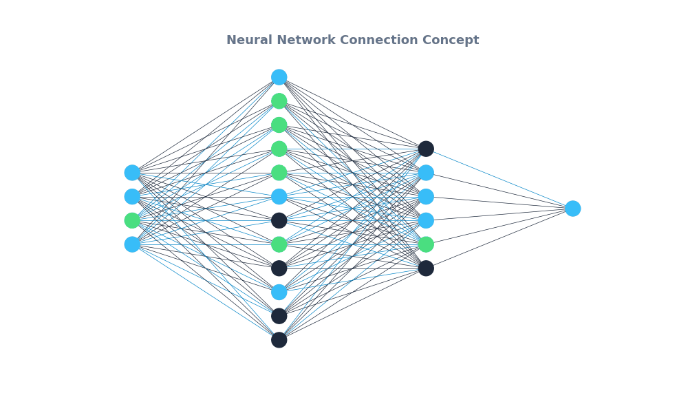

# 🧠 Neural Matrix Visualizer

[](https://www.python.org/)
[](https://pytorch.org/)
[](https://www.kali.org/)

Iseng-iseng bikin framework mini pakai **PyTorch** dan **NetworkX** buat visualisasiin gimana data ngalir (*forward propagation*) di dalam Neural Network. Proyek ini nge-render simulasi sinkronisasi data antar node secara dinamis, dan kodenya udah di-optimize lewat akselerasi hardware GPU NVIDIA CUDA (RTX 3050 Laptop).

---

## 📊 Live Preview & Konsep Visual

Proyek ini pakai formasi arsitektur **4 → 12 → 6 → 1** (Deep Neural Network). Untuk visualnya, sengaja saya konsep pakai tema *Cyberpunk Dark Mode* (perpaduan warna Biru Neon & Hijau Matrix) biar kelihatan idup pas simulasiin transfer data di tiap lapisannya.



---

## 🛠️ Detail Arsitektur Model

Struktur jaringan saraf tiruan (DNN) di dalam proyek ini saya bagi jadi beberapa bagian:

* **Input Layer (4 Node):** Tempat nampung data mentah (misal: metrik trafik jaringan atau log serangan).
* **Hidden Layer 1 (12 Node):** Proses ekstraksi data tahap awal, dikunci pakai fungsi aktivasi `ReLU`.
* **Hidden Layer 2 (6 Node):** Lapisan kompresi matriks biar pola datanya makin padat.
* **Output Layer (1 Node):** Hasil tebakan atau keputusan akhir model, pakai `Sigmoid` buat ngeluarin angka probabilitas (rentang `0` sampai `1`).

---

## 🚀 Cara Install & Run

### 1. Install Dependencies
Sebelum running, pastiin komputer kalian udah ke-install Python 3 dan library grafik bawaan ini. Kalau pakai Kali Linux modern, tinggal bypass pakai command ini:

```bash
pip install torch networkx matplotlib pillow --break-system-packages 
```

### 2. Running Script
Buat nge-generate ulang atau nge-render animasi .gif jaring-jaringnya, tinggal panggil filenya lewat terminal Linux/WSL:

```bash
python3 ai_detector.py
```

### 3. 🗂️ Isi File Repo
```
├── ai_detector.py               # Script utama (pemrosesan tensor PyTorch + Matplotlib)
├── neural_network_animation.gif # Hasil akhir render animasi jaring-jaring bergerak
└── README.md                    # Dokumentasi ini
```